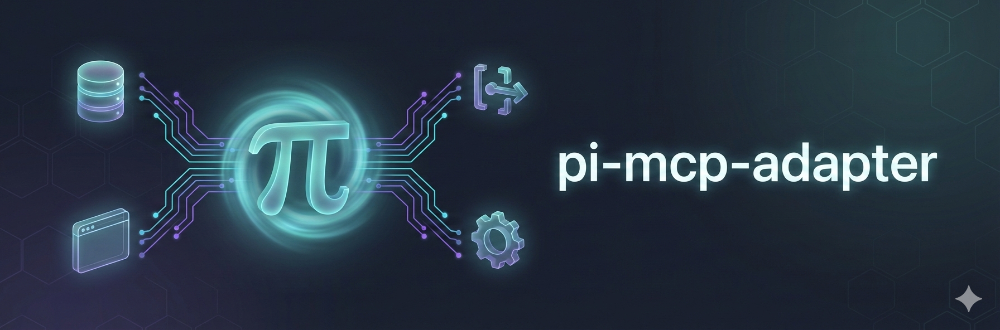

<p>
  
</p>

# Pi MCP Adapter
> Fork of https://github.com/nicobailon/pi-mcp-adapter (original by Nico Bailon).
 >
> Development repo: https://github.com/xRyul/pi-mcp-adapter-v2


Use MCP servers with [Pi](https://github.com/badlogic/pi-mono/) without burning your context window.

https://github.com/user-attachments/assets/4b7c66ff-e27e-4639-b195-22c3db406a5a

## Why This Exists

Mario wrote about [why you might not need MCP](https://mariozechner.at/posts/2025-11-02-what-if-you-dont-need-mcp/). The problem: tool definitions are verbose. A single MCP server can burn 10k+ tokens, and you're paying that cost whether you use those tools or not. Connect a few servers and you've burned half your context window before the conversation starts.

His take: skip MCP entirely, write simple CLI tools instead.

But the MCP ecosystem has useful stuff - databases, browsers, APIs. This adapter gives you access without the bloat. One proxy tool (~200 tokens) instead of hundreds. The agent discovers what it needs on-demand. Servers only start when you actually use them.

## Install

```bash
pi install npm:pi-mcp-adapter
```

Restart Pi after installation.

### Local development (this fork)

If you're developing from source, symlink the repo into Pi's extensions directory and run `/reload` in Pi:

```bash
ln -sfn /path/to/pi-mcp-adapter-v2 ~/.pi/agent/extensions/pi-mcp-adapter-v2
```


## Quick Start

Create `~/.pi/agent/mcp.json`:

```json
{
  "mcpServers": {
    "chrome-devtools": {
      "command": "npx",
      "args": ["-y", "chrome-devtools-mcp@latest"]
    }
  }
}
```

Servers are **lazy by default** — they won't connect until you actually call one of their tools. The adapter caches tool metadata so search and describe work without live connections.

```
mcp({ search: "screenshot" })
```
```
chrome_devtools_take_screenshot
  Take a screenshot of the page or element.

  Parameters:
    format (enum: "png", "jpeg", "webp") [default: "png"]
    fullPage (boolean) - Full page instead of viewport
```
```
mcp({ tool: "chrome_devtools_take_screenshot", args: '{"format": "png"}' })
```

Note: `args` is a JSON string, not an object.

Two calls instead of 26 tools cluttering the context.

## Config

### Server Options

```json
{
  "mcpServers": {
    "my-server": {
      "command": "npx",
      "args": ["-y", "some-mcp-server"],
      "lifecycle": "lazy",
      "idleTimeout": 10
    }
  }
}
```

| Field | Description |
|-------|-------------|
| `command` | Executable for stdio transport |
| `args` | Command arguments |
| `env` | Environment variables (`${VAR}` interpolation) |
| `cwd` | Working directory |
| `url` | HTTP endpoint (StreamableHTTP with SSE fallback) |
| `auth` | `"bearer"` or `"oauth"` |
| `bearerToken` / `bearerTokenEnv` | Token or env var name |
| `lifecycle` | `"lazy"` (default), `"eager"`, or `"keep-alive"` |
| `idleTimeout` | Minutes before idle disconnect (overrides global) |
| `exposeResources` | Expose MCP resources as tools (default: true) |
| `directTools` | `true`, `string[]`, or `false` — register tools individually instead of through proxy |
| `debug` | Show server stderr (default: false) |

### Lifecycle Modes

- **`lazy`** (default) — Don't connect at startup. Connect on first tool call. Disconnect after idle timeout. Cached metadata keeps search/list working without connections.
- **`eager`** — Connect at startup but don't auto-reconnect if the connection drops. No idle timeout by default (set `idleTimeout` explicitly to enable).
- **`keep-alive`** — Connect at startup. Auto-reconnect via health checks. No idle timeout. Use for servers you always need available.

### Settings

```json
{
  "settings": {
    "toolPrefix": "server",
    "idleTimeout": 10
  },
  "mcpServers": { }
}
```

| Setting | Description |
|---------|-------------|
| `toolPrefix` | `"server"` (default), `"short"` (strips `-mcp` suffix), or `"none"` |
| `idleTimeout` | Global idle timeout in minutes (default: 10, 0 to disable) |
| `directTools` | Global default for all servers (default: false). Per-server overrides this. |

Per-server `idleTimeout` overrides the global setting.

### Direct Tools

By default, all MCP tools are accessed through the single `mcp` proxy tool. This keeps context small but means the LLM has to discover tools via search. If you want specific tools to show up directly in the agent's tool list — alongside `read`, `bash`, `edit`, etc. — add `directTools` to your config.

Per-server:

```json
{
  "mcpServers": {
    "chrome-devtools": {
      "command": "npx",
      "args": ["-y", "chrome-devtools-mcp@latest"],
      "directTools": true
    },
    "github": {
      "command": "npx",
      "args": ["-y", "@modelcontextprotocol/server-github"],
      "directTools": ["search_repositories", "get_file_contents"]
    },
    "huge-server": {
      "command": "npx",
      "args": ["-y", "mega-mcp@latest"]
    }
  }
}
```

| Value | Behavior |
|-------|----------|
| `true` | Register all tools from this server as individual Pi tools |
| `["tool_a", "tool_b"]` | Register only these tools (use original MCP names) |
| Omitted or `false` | Proxy only (default) |

To set a global default for all servers:

```json
{
  "settings": {
    "directTools": true
  },
  "mcpServers": {
    "huge-server": {
      "directTools": false
    }
  }
}
```

Per-server `directTools` overrides the global setting. The example above registers direct tools for every server except `huge-server`.

Each direct tool costs ~150-300 tokens in the system prompt (name + description + schema). Good for targeted sets of 5-20 tools. For servers with 75+ tools, stick with the proxy or pick specific tools with a `string[]`.

Direct tools register from the metadata cache (`~/.pi/agent/mcp-cache.json`), so no server connections are needed at startup. On the first session after adding `directTools` to a new server, the cache won't exist yet — tools fall back to proxy-only and the cache populates in the background. Restart Pi and they'll be available. To force-refresh the cache: open `/mcp`, select the server and press `ctrl+r`, then restart Pi.

**Interactive configuration:** Run `/mcp` to open an interactive panel showing all servers with connection status, tools, and direct/proxy toggles. Reconnect servers, set OAuth tokens, and toggle tools between direct and proxy — all from one overlay. Changes are written to your config file; restart Pi to apply.

Panel shortcuts:
- `n` add server (paste/edit JSON)
- `e` edit selected server (JSON)
- `d` delete selected server
- `/` name search, `?` description search
- `ctrl+r` reconnect selected server (hard reconnect + refresh cache)
- `ctrl+alt+r` reconnect all servers
- `ctrl+a` auth setup for selected server (OAuth token paste if configured)
- `ctrl+s` save changes (servers + direct tools; restart required for direct tools)

**Subagent integration:** If you use the subagent extension, agents can request direct MCP tools in their frontmatter with `mcp:server-name` syntax. See the subagent README for details.

### Import Existing Configs

Already have MCP set up elsewhere? Import it:

```json
{
  "imports": ["cursor", "claude-code", "claude-desktop"],
  "mcpServers": { }
}
```

Supported: `cursor`, `claude-code`, `claude-desktop`, `vscode`, `windsurf`, `codex`

### Project Config

Add `.pi/mcp.json` in a project root for project-specific servers. Project config overrides global and imported servers.

## Usage

| Mode | Example |
|------|---------|
| Status | `mcp({ })` |
| List server | `mcp({ server: "name" })` |
| Search | `mcp({ search: "screenshot navigate" })` |
| Describe | `mcp({ describe: "tool_name" })` |
| Call | `mcp({ tool: "...", args: '{"key": "value"}' })` |
| Connect | `mcp({ connect: "server-name" })` |

Search includes both MCP tools and Pi tools (from extensions). Pi tools appear first with `[pi tool]` prefix. Space-separated words are OR'd.

Tool names are fuzzy-matched on hyphens and underscores — `context7_resolve_library_id` finds `context7_resolve-library-id`.

## Commands

| Command | What it does |
|---------|--------------|
| `/mcp` | Interactive panel (server status, tool toggles, reconnect, OAuth) |

## How It Works

- One `mcp` tool in context (~200 tokens) instead of hundreds
- Servers are lazy by default — they connect on first tool call, not at startup
- Tool metadata is cached to disk so search/list/describe work without live connections
- Idle servers disconnect after 10 minutes (configurable), reconnect automatically on next use
- npx-based servers resolve to direct binary paths, skipping the ~143 MB npm parent process
- MCP server validates arguments, not the adapter
- Keep-alive servers get health checks and auto-reconnect
- Specific tools can be promoted from the proxy to first-class Pi tools via `directTools` config, so the LLM sees them directly instead of having to search

## Limitations

- OAuth tokens obtained externally (no browser flow)
- No automatic token refresh
- Cross-session server sharing not yet implemented (each Pi session runs its own server processes)
